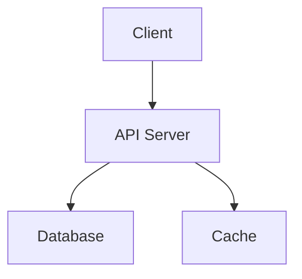

<overview>
Standard documentation files for GitHub projects. Each document has a specific purpose and expected content structure. This reference defines what each document should contain.
</overview>

<readme>
<purpose>
First impression of the project. Helps users understand what it does, how to install it, and how to get started quickly.
</purpose>

<required_sections>
1. **Title and badges** - Project name, status indicators
2. **Description** - What it does in 1-3 sentences
3. **Installation** - How to install (copy-pasteable commands)
4. **Quick start** - Minimal working example
5. **License** - What license applies
</required_sections>

<recommended_sections>
- Table of contents (if long)
- Features list
- Usage examples (simple → advanced)
- Configuration options
- API overview
- Requirements/prerequisites
- Contributing link
- Acknowledgments
</recommended_sections>

<structure>
```markdown
# Project Name

[](link)

> One-line description

## Table of Contents
[if needed]

## Installation

## Quick Start

## Features

## Usage

### Basic Usage

### Advanced Usage

## Configuration

## API Reference

## Contributing

## License
```
</structure>
</readme>

<contributing>
<purpose>
Guide contributors on how to participate in the project. Reduces friction for new contributors and sets expectations.
</purpose>

<required_sections>
1. **Welcome** - Encourage contributions
2. **Code of conduct** - Link to CODE_OF_CONDUCT.md
3. **How to report bugs** - Issue template or process
4. **How to suggest features** - Feature request process
5. **Development setup** - How to set up local environment
6. **Pull request process** - What to do before submitting
</required_sections>

<recommended_sections>
- Code style guidelines
- Commit message format
- Testing requirements
- Documentation requirements
- Review process
- Release process (for maintainers)
</recommended_sections>

<structure>
```markdown
# Contributing to Project Name

Thank you for your interest in contributing!

## Code of Conduct

Please read our [Code of Conduct](CODE_OF_CONDUCT.md).

## How Can I Contribute?

### Reporting Bugs

### Suggesting Features

### Pull Requests

## Development Setup

### Prerequisites

### Installation

### Running Tests

## Style Guidelines

### Code Style

### Commit Messages

## Questions?
```
</structure>
</contributing>

<code_of_conduct>
<purpose>
Establish community standards and expectations for behavior. Creates a welcoming environment.
</purpose>

<recommendation>
Use the **Contributor Covenant** - the industry standard adopted by major projects including Linux, Kubernetes, and Rails.
</recommendation>

<versions>
- Contributor Covenant 2.1 (current)
- Contributor Covenant 2.0
- Custom (only if specific needs)
</versions>

<required_elements>
1. Pledge - What we commit to
2. Standards - Expected behavior
3. Enforcement - How violations are handled
4. Contact info - Who to report to
5. Attribution - Credit to Contributor Covenant
</required_elements>

<adoption>
```markdown
# Contributor Covenant Code of Conduct

## Our Pledge

We as members, contributors, and leaders pledge to make participation
in our community a harassment-free experience for everyone...

## Our Standards

Examples of behavior that contributes to a positive environment...

## Enforcement Responsibilities

Community leaders are responsible for clarifying and enforcing...

## Scope

This Code of Conduct applies within all community spaces...

## Enforcement

Instances of abusive, harassing, or otherwise unacceptable behavior
may be reported to the community leaders responsible for enforcement at
[EMAIL].

## Attribution

This Code of Conduct is adapted from the [Contributor Covenant][homepage],
version 2.1.

[homepage]: https://www.contributor-covenant.org
```
</adoption>
</code_of_conduct>

<changelog>
<purpose>
Document all notable changes between releases. Helps users understand what changed and why.
</purpose>

<standard>
Follow **Keep a Changelog** format (keepachangelog.com).
</standard>

<categories>
- **Added** - New features
- **Changed** - Changes to existing functionality
- **Deprecated** - Features to be removed
- **Removed** - Removed features
- **Fixed** - Bug fixes
- **Security** - Security fixes
</categories>

<structure>
```markdown
# Changelog

All notable changes to this project will be documented in this file.

The format is based on [Keep a Changelog](https://keepachangelog.com/en/1.1.0/),
and this project adheres to [Semantic Versioning](https://semver.org/spec/v2.0.0.html).

## [Unreleased]

### Added
- New feature X

## [1.2.0] - 2024-01-15

### Added
- Feature A
- Feature B

### Changed
- Updated dependency X to v2.0

### Fixed
- Bug in function Y (#123)

## [1.1.0] - 2024-01-01

### Added
- Initial feature set

[Unreleased]: https://github.com/owner/repo/compare/v1.2.0...HEAD
[1.2.0]: https://github.com/owner/repo/compare/v1.1.0...v1.2.0
[1.1.0]: https://github.com/owner/repo/releases/tag/v1.1.0
```
</structure>

<tips>
- Link version numbers to GitHub releases/compare
- Date format: YYYY-MM-DD (ISO 8601)
- Keep "Unreleased" section at top
- Be specific about what changed and why
- Reference issue/PR numbers
</tips>
</changelog>

<license>
<purpose>
Declare the legal terms under which the project can be used, modified, and distributed.
</purpose>

<common_licenses>
| License | Use Case |
|---------|----------|
| MIT | Permissive, simple, most popular |
| Apache 2.0 | Permissive with patent grant |
| GPL 3.0 | Copyleft, derivatives must be open |
| BSD 3-Clause | Permissive, similar to MIT |
| ISC | Simplified MIT/BSD |
| Unlicense | Public domain dedication |
</common_licenses>

<format>
Full license text in LICENSE or LICENSE.md file.

Include in README:
```markdown
## License

This project is licensed under the MIT License - see [LICENSE](LICENSE) for details.
```
</format>

<validation>
Ensure license in:
- LICENSE file matches
- package.json/Cargo.toml/pyproject.toml
- README license section
- Any file headers
</validation>
</license>

<architecture>
<purpose>
Explain the system design, component relationships, and key decisions. Helps contributors understand how pieces fit together.
</purpose>

<location>
- `docs/ARCHITECTURE.md`
- `ARCHITECTURE.md` (root)
- `docs/design.md`
</location>

<required_sections>
1. **Overview** - High-level description
2. **Components** - Major parts and their responsibilities
3. **Data flow** - How data moves through the system
4. **Directory structure** - What's where in the codebase
</required_sections>

<recommended_sections>
- System diagram (Mermaid or ASCII)
- Key design decisions and rationale
- Technology choices
- Extension points
- Known limitations
</recommended_sections>

<structure>
```markdown
# Architecture

## Overview

Brief description of what the system does architecturally.

## System Diagram



## Components

### Component A
Purpose and responsibility.

### Component B
Purpose and responsibility.

## Data Flow

1. User initiates action
2. Component A processes
3. Component B persists
4. Response returned

## Directory Structure

```
src/
├── api/        # HTTP handlers
├── core/       # Business logic
├── db/         # Database layer
└── utils/      # Shared utilities
```

## Design Decisions

### Decision 1
Rationale for choice.

### Decision 2
Rationale for choice.
```
</structure>
</architecture>

<api_documentation>
<purpose>
Reference documentation for all public interfaces. Helps developers use the library/API correctly.
</purpose>

<location>
- `docs/api.md` or `docs/API.md`
- `docs/api/` directory with multiple files
- Generated docs (rustdoc, typedoc, sphinx)
- Inline in README for small APIs
</location>

<per_function_documentation>
1. **Signature** - Full function signature with types
2. **Description** - What it does
3. **Parameters** - Each parameter explained
4. **Returns** - What's returned
5. **Example** - Working usage example
6. **Throws/Errors** - Possible errors
7. **See also** - Related functions
</per_function_documentation>

<structure>
```markdown
# API Reference

## Module A

### `functionName(param1, param2)`

Brief description of what this function does.

**Parameters:**
- `param1` (Type) - Description of param1
- `param2` (Type, optional) - Description of param2. Default: `value`

**Returns:**
- (ReturnType) - Description of return value

**Throws:**
- `ErrorType` - When this error occurs

**Example:**
```python
result = function_name("value", option=True)
print(result)  # Expected output
```

**See also:** [`relatedFunction`](#relatedfunction)

---

### `anotherFunction()`

...
```
</structure>

<generation_tools>
| Language | Tool |
|----------|------|
| Python | Sphinx, pdoc, mkdocs |
| TypeScript/JS | TypeDoc, JSDoc |
| Rust | rustdoc (built-in) |
| Go | godoc (built-in) |
| Java | Javadoc |
</generation_tools>
</api_documentation>

<security_policy>
<purpose>
Tell users how to report security vulnerabilities. Required for responsible disclosure.
</purpose>

<location>
- `SECURITY.md` (GitHub will detect and display)
- `.github/SECURITY.md`
</location>

<required_sections>
1. Supported versions - Which versions get security updates
2. Reporting process - How to report (NOT public issues)
3. Response timeline - When to expect response
</required_sections>

<structure>
```markdown
# Security Policy

## Supported Versions

| Version | Supported          |
| ------- | ------------------ |
| 2.x.x   | :white_check_mark: |
| 1.x.x   | :x:                |

## Reporting a Vulnerability

Please report security vulnerabilities by emailing security@example.com.

Do NOT create a public GitHub issue.

You can expect:
- Acknowledgment within 48 hours
- Status update within 7 days
- Credit in the advisory (if desired)
```
</structure>
</security_policy>

<priority_order>
When generating documentation, prioritize in this order:

1. **README.md** - Essential, always first
2. **LICENSE** - Legal requirement
3. **CONTRIBUTING.md** - Important for open source
4. **CODE_OF_CONDUCT.md** - Community standard
5. **CHANGELOG.md** - Important for releases
6. **ARCHITECTURE.md** - Helpful for complex projects
7. **API documentation** - Important for libraries
8. **SECURITY.md** - Important for production software
</priority_order>
