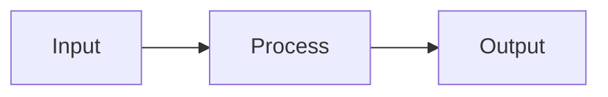

<overview>
Modern GitHub documentation styling conventions for professional, readable, and visually appealing documentation. These patterns are widely adopted across popular open-source projects.
</overview>

<badges>
<placement>
Badges go at the very top of README.md, immediately after the title. Group related badges together.
</placement>

<recommended_badges>
**Build/CI status:**
```markdown
[](https://github.com/owner/repo/actions/workflows/ci.yml)
```

**Version/Release:**
```markdown
[](https://www.npmjs.com/package/package-name)
[](https://crates.io/crates/crate-name)
[](https://pypi.org/project/package-name/)
```

**License:**
```markdown
[](https://opensource.org/licenses/MIT)
[](https://opensource.org/licenses/Apache-2.0)
```

**Coverage:**
```markdown
[](https://codecov.io/gh/owner/repo)
```

**Downloads:**
```markdown
[](https://www.npmjs.com/package/package-name)
```
</recommended_badges>

<badge_services>
- **shields.io** - Most common, highly customizable
- **badgen.net** - Fast alternative
- **GitHub Actions** - Native workflow badges
- **Codecov/Coveralls** - Coverage badges
</badge_services>

<example>
```markdown
# Project Name

[](https://github.com/owner/repo/actions)
[](https://npmjs.com/package/package)
[](LICENSE)

> One-line description of the project
```
</example>
</badges>

<table_of_contents>
<when_to_use>
Include TOC when README exceeds ~100 lines or has more than 5 main sections.
</when_to_use>

<format>
```markdown
## Table of Contents

- [Installation](#installation)
- [Quick Start](#quick-start)
- [Usage](#usage)
  - [Basic Usage](#basic-usage)
  - [Advanced Usage](#advanced-usage)
- [Configuration](#configuration)
- [API Reference](#api-reference)
- [Contributing](#contributing)
- [License](#license)
```
</format>

<auto_generation>
Many editors and tools can auto-generate TOC. Common markers:
```markdown
<!-- toc -->
<!-- tocstop -->
```
</auto_generation>
</table_of_contents>

<collapsible_sections>
<syntax>
```markdown
<details>
<summary>Click to expand</summary>

Content goes here. **Markdown works inside.**

- Lists work
- Code blocks work

```python
code_works_too()
```

</details>
```
</syntax>

<use_cases>
- Long installation instructions for multiple platforms
- Verbose configuration examples
- Troubleshooting guides
- Full API listings when summary is available
- Historical changelog entries
</use_cases>

<example>
```markdown
<details>
<summary>📦 Installation for all platforms</summary>

### macOS
```bash
brew install tool
```

### Linux
```bash
curl -sSL https://install.example.com | sh
```

### Windows
```powershell
winget install tool
```

</details>
```
</example>
</collapsible_sections>

<emoji_usage>
<principles>
- Use sparingly and consistently
- Choose semantic emoji (📦 for installation, 🚀 for features)
- Either use emoji for all major headings or none
- Don't mix emoji styles (outlined vs filled)
</principles>

<common_emoji_headers>
```markdown
## 📦 Installation
## 🚀 Quick Start
## ✨ Features
## 📖 Usage
## ⚙️ Configuration
## 📚 Documentation
## 🤝 Contributing
## 📄 License
## 🐛 Bug Reports
## 💡 Feature Requests
## 🔧 Development
## 🧪 Testing
## 📝 Changelog
```
</common_emoji_headers>

<when_to_skip>
Skip emoji if:
- Project has formal/enterprise tone
- Mixed with other projects that don't use emoji
- Team preference is against
</when_to_skip>
</emoji_usage>

<code_blocks>
<always_specify_language>
```markdown
```python
def example():
    pass
```

```bash
npm install package
```

```json
{
  "key": "value"
}
```
```
</always_specify_language>

<common_language_identifiers>
- `bash`, `sh`, `shell` - Shell commands
- `python`, `py` - Python
- `javascript`, `js` - JavaScript
- `typescript`, `ts` - TypeScript
- `rust`, `rs` - Rust
- `go` - Go
- `json` - JSON
- `yaml`, `yml` - YAML
- `toml` - TOML
- `markdown`, `md` - Markdown
- `sql` - SQL
- `diff` - Diffs
- `console` - Terminal output with prompts
</common_language_identifiers>

<terminal_output>
Use `console` or plain text for terminal output:
```console
$ npm install
added 50 packages in 2s
```
</terminal_output>
</code_blocks>

<heading_hierarchy>
<rules>
- Never skip heading levels (h1 → h3)
- One h1 per document (the title)
- Use h2 for major sections
- Use h3 for subsections
- Rarely need h4 or deeper
</rules>

<correct>
```markdown
# Project Title

## Installation

### Prerequisites

### Install via npm

## Usage

### Basic Usage

### Advanced Usage
```
</correct>

<incorrect>
```markdown
# Project Title

### Installation  <!-- ❌ Skipped h2 -->

## Usage

#### Basic Usage  <!-- ❌ Skipped h3 -->
```
</incorrect>
</heading_hierarchy>

<links>
<internal_links>
```markdown
See [Contributing](CONTRIBUTING.md) for guidelines.
Check [API Reference](docs/api.md) for details.
```
</internal_links>

<section_links>
```markdown
See [Configuration](#configuration) below.
As mentioned in [Quick Start](#quick-start)...
```
</section_links>

<external_links>
```markdown
Built with [React](https://reactjs.org).
Uses [shields.io](https://shields.io) for badges.
```
</external_links>

<reference_style>
For documents with many links:
```markdown
This uses [React][react] and [TypeScript][ts].

[react]: https://reactjs.org
[ts]: https://www.typescriptlang.org
```
</reference_style>
</links>

<images_and_diagrams>
<screenshots>
```markdown

```

Store in `docs/images/` or `assets/` directory.
</screenshots>

<mermaid_diagrams>
GitHub renders Mermaid natively:

```markdown

```
</mermaid_diagrams>

<ascii_diagrams>
For maximum compatibility:
```
┌─────────────┐     ┌─────────────┐
│   Client    │────▶│   Server    │
└─────────────┘     └─────────────┘
```
</ascii_diagrams>
</images_and_diagrams>

<tables>
<format>
```markdown
| Feature | Free | Pro |
|---------|:----:|:---:|
| Basic   | ✅   | ✅  |
| Advanced| ❌   | ✅  |
| Support | ❌   | ✅  |
```
</format>

<alignment>
- `:---` left align
- `:---:` center align
- `---:` right align
</alignment>
</tables>

<alerts_and_callouts>
<github_native>
GitHub supports native alerts (since 2023):

```markdown
> [!NOTE]
> Useful information that users should know.

> [!TIP]
> Helpful advice for doing things better.

> [!IMPORTANT]
> Key information users need to know.

> [!WARNING]
> Urgent info that needs immediate attention.

> [!CAUTION]
> Advises about risks or negative outcomes.
```
</github_native>

<fallback>
For broader compatibility:
```markdown
> **Note:** Information here.

> ⚠️ **Warning:** Caution here.
```
</fallback>
</alerts_and_callouts>

<anti_patterns>
<avoid>
- Walls of text without headings
- Code blocks without language identifiers
- Broken links
- Outdated badges showing failing builds
- Inconsistent emoji usage
- Missing alt text on images
- Screenshots instead of copyable text
- H1 headers in the middle of documents
</avoid>
</anti_patterns>
